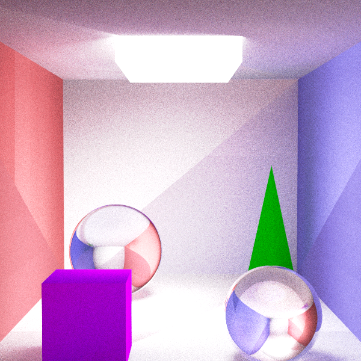

# GPURaytracing
GPU RAY TRAVERSAL USING OPENCL 

THE XCODE PROJECT WAS DEVELOPED UNDER YOSEMITE OS X 10.10, IF YOU HAVE A DIFFERENT VERSION CHANGE THE PROJECT PROPERTIES ACCORDINGLY.

ALWAYS CHANGE THE const int samps FOR SUPER-SAMPLING INSIDE THE RADIANCEGPU.CL ACCORDING TO YOUR NEEDS

bool USE_CPU TO CHOOSE FOR CPU OR GPU PLATFORMS. IF MORE THAN ONE GPU PICK BY DEVICES[1],..,DEVICES[N].

CHANGE THE PATHS TO YOUR FILES.

----- 
 
THE HOST APPLICATION DEVELOPED IN OPENCL CAN BE USED IN OTHER PROJECTS ASWELL.

THE SCENE CAN BE ARBIRTRARY (TRIANGLES AND SPHERES).

IF THE KERNEL DOES NOT FUNCTION APPROPRIATELY WITH THE GPU ENABLED, THEN YOU HAVE TO DISABLE THE WATCHDOG ATTRIBUTE OF YOUR GPU. SHOULD WORK FINE IN NVIDIA QUADRO AND TESLA.

------

TESTED ON: ONBOARD INTEL HD IRIS PRO 5200, NVIDIA GEFORCE GTX750, NVIDIA GEFORCE GT750M

IF RUNNING THE APPLICATION WITH GRID ON CHOOSE THE RATIO ACCORDINGLY FOR DESIRED GRID RESOLUTION.

